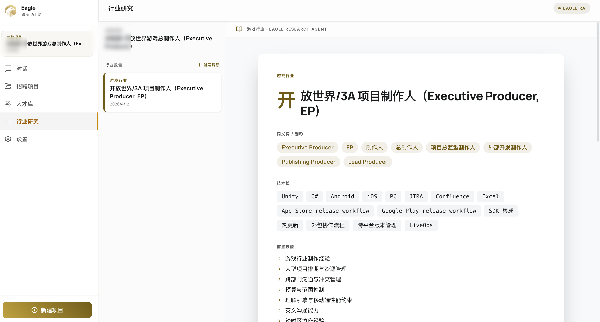
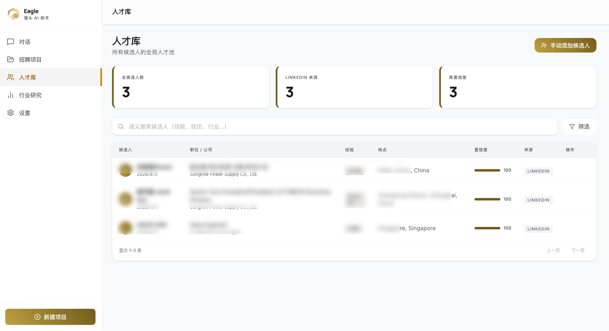
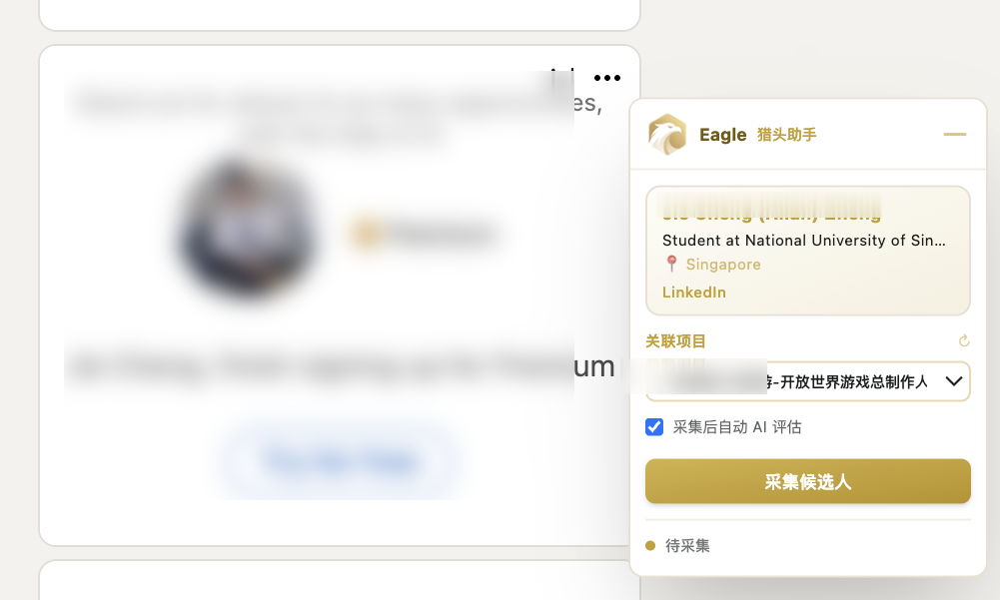

<h1 align="center">🦅 Eagle</h1>

<p align="center">
  <strong>专为猎头设计的 Agentic AI 系统</strong><br>
  通过自然语言对话管理招聘项目、自动评估候选人匹配度、执行行业调研，配合 Chrome 插件从招聘平台一键采集候选人
</p>
<p align="center">
  <a href="LICENSE"></a>
  <a href="https://www.python.org/"></a>
  <a href="https://nodejs.org/"></a>
</p>


<p align="center">
  <a href="#快速开始quick-start开发模式">快速开始</a> ·
  <a href="#项目特性features">项目特性</a> ·
  <a href="#项目结构architecture">架构</a> ·
  <a href="#配置要求configuration-env-关键字段">配置</a> ·
  <a href="#打包桌面应用build">打包</a>
</p>

---

## 图标


## 应用内截图Screenshots

| Chat（CA 对话） | 行业报告 |
|---|---|
|  |  |

| 人才池 | Chrome 插件 |
|---|---|
|  |  |

---

## 项目特性Features

- **Coordinator Agent (CA)**：自然语言对话，自动解析 JD、编排后续任务，无需填写结构化表单
- **Research Agent (RA)**：自动行业调研，生成 Markdown 报告 + 技能图谱（Ontology）
- **Evaluator Agent (EA)**：多维度候选人评分与项目匹配
- **Chrome 插件**：在招聘平台页面一键采集候选人简历到本地人才池
- **支持 OpenAI / Anthropic**：通过 `LLM_PROVIDER` 切换（目前仅测试了 OpenAI SDK）
- **Tauri 打包**：跨平台桌面应用，macOS 输出 `.app` / `.dmg`

---

## 项目结构Architecture

```
eagle/
├── frontend/     # React + TypeScript + Vite，通过 Tauri 打包为桌面应用
├── backend/      # FastAPI + SQLAlchemy + LanceDB，由 PyInstaller 打包内嵌进应用
└── extension/    # Chrome 插件（WXT），独立加载，负责抓取候选人
```

**数据流**：Chrome 插件 → 后端 REST API → SQLite / LanceDB → 前端 UI / AI Agents

> **数据存储**：所有数据存储在本地（SQLite + LanceDB），无需外部数据库服务。存放目录在桌面 Eagle 文件夹中，需要获得访问权限。

---

## 前置要求Prerequisites

- **Python 3.12+** 和 [uv](https://docs.astral.sh/uv/)
- **Node.js 18+** 和 [pnpm](https://pnpm.io/)
- **LLM API Key**
- **Embedding API Key**

---

## 快速开始Quick Start（开发模式）

### 1. 启动后端

```bash
cd backend
uv sync                               # 安装依赖
cp .env.example .env && vim .env      # 配置环境变量（见下方说明）
uv run alembic upgrade head           # 执行数据库迁移
uv run python main.py --dev           # 启动后端服务（开发模式，热重载）
```

后端启动后：
- API 文档：http://localhost:52777/docs
- 健康检查：http://localhost:52777/api/health

### 2. 启动前端

```bash
cd frontend
pnpm install
pnpm build
pnpm dev          # dev server at http://localhost:5173

# 如果想看 Tauri 窗口
pnpm tauri dev
```

### 3. 加载 Chrome 插件（可选）

```bash
cd extension
pnpm install
pnpm build        # 构建插件到 extension/.output/chrome-mv3/
```

1. 打开 `chrome://extensions/`
2. 开启「开发者模式」
3. 点击「加载已解压的扩展程序」，选择 `extension/.output/chrome-mv3/`
4. 点击扩展图标，配置 API 地址和 API Key
5. 打开任意 `linkedin.com/in/xxx` 页面，右侧会出现 Eagle 浮窗

---

## 配置要求Configuration（`.env` 关键字段）

```env
# LLM Provider：选择 "openai" 或 "anthropic"
LLM_PROVIDER=openai
LLM_API_KEY=sk-...
LLM_MODEL=gpt-4o
# LLM_BASE_URL=https://your-provider.example.com/v1  # 可选，自定义端点

# Embedding（OpenAI 兼容端点）
EMBEDDING_API_KEY=sk-...
EMBEDDING_MODEL=text-embedding-3-small
EMBEDDING_DIMENSIONS=1536
# EMBEDDING_BASE_URL=https://your-provider.example.com/v1  # 可选
```

完整环境变量说明见 [backend/README.md](backend/README.md)。

---

## 打包桌面应用Build

```bash
# 1. 打包后端（生成二进制，内嵌进 Tauri bundle）
cd backend
uv run pyinstaller eagle-backend.spec --noconfirm

# 2. 打包整个桌面应用
cd ../frontend
pnpm tauri build
# 如果需要临时分发：
bash scripts/package-dmg.sh
```

macOS 输出产物：
- `frontend/src-tauri/target/release/bundle/macos/Eagle.app` — 可直接运行的 .app
- `frontend/src-tauri/target/release/bundle/dmg/Eagle_0.1.0_aarch64.dmg` — 可双击挂载的磁盘镜像

---

## 数据存储Data Storage

Eagle 首次启动时在桌面自动创建数据目录：

```
~/Desktop/Eagle/
├── projects/                         # 猎头项目文件夹
│   └── 2026-03-某科技/
│       └── reports/                  # RA 生成的 Markdown 调研报告
└── data/
    ├── eagle.db                      # SQLite 数据库
    └── lancedb/                      # LanceDB 向量数据库
```

---

## License

This project is licensed under the [AGPL-3.0 License](LICENSE).
