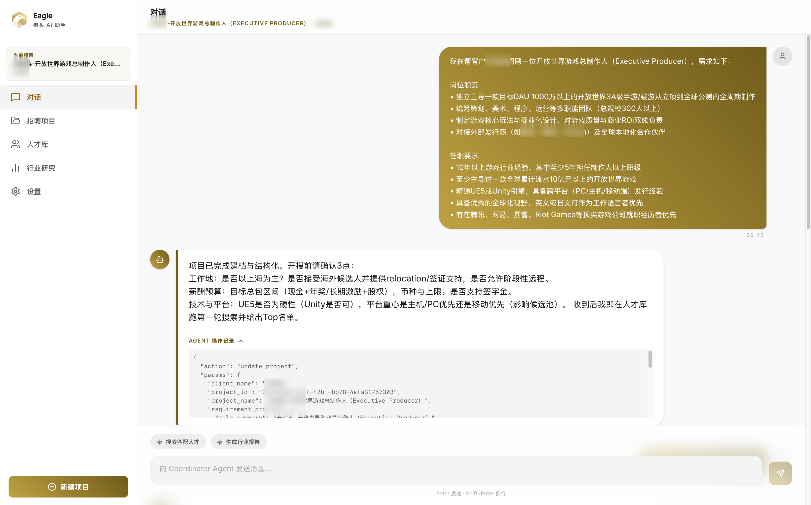
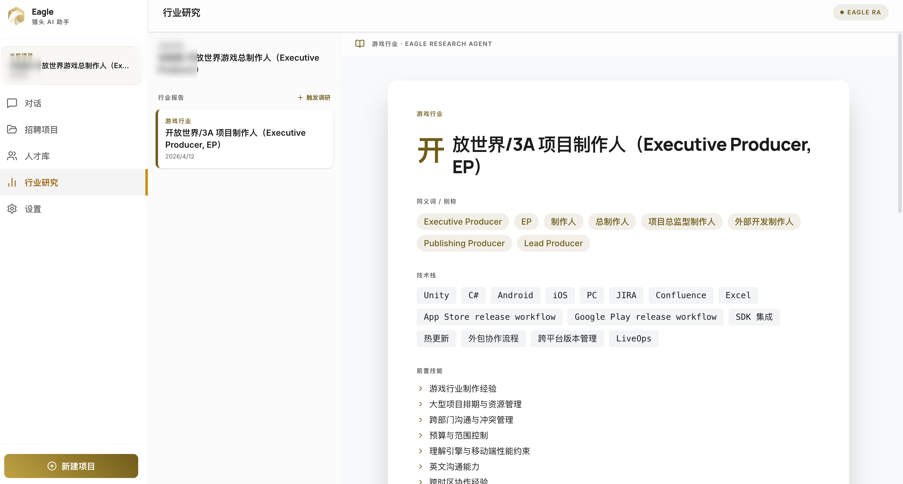
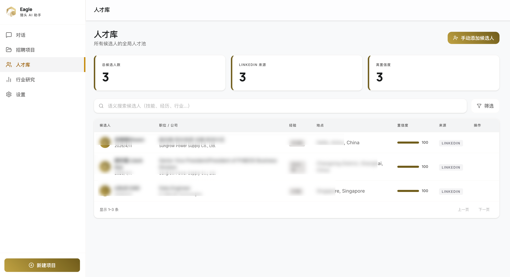
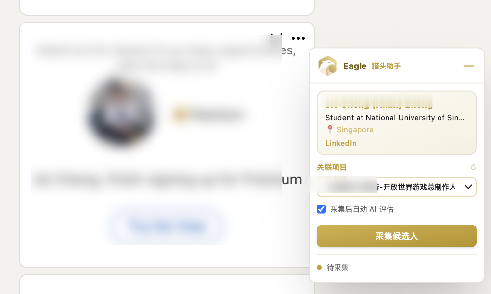

<h1 align="center">🦅 Eagle</h1>

<p align="center">
  <strong>专为猎头设计的 Agentic AI 系统</strong><br>
  通过自然语言对话管理招聘项目、自动评估候选人匹配度、执行行业调研，配合 Chrome 插件从招聘平台一键采集候选人
</p>
<p align="center">
  <a href="LICENSE"></a>
  <a href="https://www.python.org/"></a>
  <a href="https://nodejs.org/"></a>
</p>


<p align="center">
  <a href="#快速开始quick-start开发模式">快速开始</a> ·
  <a href="#项目特性features">项目特性</a> ·
  <a href="#项目结构architecture">架构</a> ·
  <a href="#配置要求configuration-env-关键字段">配置</a> ·
  <a href="#打包桌面应用build">打包</a>
</p>

---

## 图标


## v1版本的旧应用内截图Screenshots

| Chat（CA 对话） | 行业报告 |
|---|---|
|  |  |

| 人才池 | Chrome 插件 |
|---|---|
|  |  |

---

## 项目特性Features

### Agents
- **Coordinator Agent (CA)**：自然语言对话，自动解析 JD、编排后续任务，无需填写结构化表单。支持**流式回答（SSE）**与 **WebSocket 项目 bootstrap**，新建项目和首次 CA 解析在同一条连接里完成
- **Research Agent (RA)**：自动行业调研，使用 **Tavily Web Search** 并行抓取，产出 Markdown 报告 + 技能图谱（Ontology）+ 向量化知识块
- **Evaluator Agent (EA)**：多维度候选人评分与项目匹配，结合项目上下文，输出推荐理由 + 风险提示
- **Talent Agent (TA)**：多格式候选人录入（图片截图 / PDF / Word / 文字粘贴），AI 解析结构化信息，**手机/邮箱/姓名+公司**三级查重，支持覆盖或跳过

### 项目与协作
- **多线程对话**：每个项目下可以开多条独立 thread，CA 在每条 thread 内保持独立上下文
- **人才清单（Talent Lists）**：跨项目复用的候选人收藏夹，记录 outreach 状态（已联系 / 已安排 / 已加入项目），支持把搜索条件快照保存为清单一键复跑
- **混合检索（Hybrid Search）**：SQL 硬过滤 + SQLite **FTS5 全文索引** + LanceDB 向量召回，用 **RRF 倒数排名融合**输出综合排序；自动识别手机号/邮箱/LinkedIn URL 走精确匹配快路径
- **智能查询改写**：自由文本搜索时由 LLM 抽取硬性过滤条件 + 语义残余（`/api/candidates/rewrite-query`），简单查询走规则门，跳过 LLM 调用
- **学校归一化**：候选人录入时把"清华"、"Tsinghua University"、"清华大学（深圳）"等写法收敛到统一 canonical 名

### 集成与运维
- **支持 OpenAI / Anthropic**：通过 `LLM_PROVIDER` 切换
- **运行时热更新 API Key/Model**：前端 Settings 页修改 LLM/Embedding 配置后通过 `PUT /api/settings` 立即生效并写回 `.env`，无需重启后端
- **Chrome 插件**：在 **LinkedIn / 猎聘** 页面一键采集候选人简历到本地人才池
- **Tauri 打包**：跨平台桌面应用，macOS 输出 `.app` / `.dmg`，后端 PyInstaller 打成 sidecar 内嵌
- **本地存储**：SQLite + LanceDB 全部落在本地 `~/Desktop/Eagle/`，无需任何外部数据库服务

---

## 项目结构Architecture

```
eagle/
├── frontend/     # React + TypeScript + Vite，通过 Tauri 打包为桌面应用
├── backend/      # FastAPI + SQLAlchemy + LanceDB，由 PyInstaller 打包内嵌进应用
└── extension/    # Chrome 插件（WXT），独立加载，负责抓取候选人
```

**数据流**：Chrome 插件 → 后端 REST API → SQLite / LanceDB → 前端 UI / AI Agents

> **数据存储**：所有数据存储在本地（SQLite + LanceDB），无需外部数据库服务。存放目录在桌面 Eagle 文件夹中，需要获得访问权限。

---

## 前置要求Prerequisites

- **Python 3.12+** 和 [uv](https://docs.astral.sh/uv/)
- **Node.js 18+** 和 [pnpm](https://pnpm.io/)
- **LLM API Key**（OpenAI 或 Anthropic）
- **Embedding API Key**（OpenAI 兼容端点）
- **Tavily API Key**（Research Agent 用于行业调研的网页搜索；不配置则 RA 不可用，其他功能不受影响）

---

## 快速开始Quick Start（开发模式）

```bash
git clone git@github.com:HowdyBunny/eagle.git
cd eagle
```

### 1. 启动后端

```bash
cd backend
uv sync                               # 安装依赖
cp .env.example .env && vim .env      # 配置环境变量（见下方说明）
uv run alembic upgrade head           # 执行数据库迁移
uv run python main.py --dev           # 启动后端服务（开发模式，热重载）
```

后端启动后：
- API 文档：http://localhost:52777/docs
- 健康检查：http://localhost:52777/api/health

### 2. 启动前端

```bash
cd frontend
pnpm install
pnpm build
pnpm dev          # dev server at http://localhost:5173

# 如果想看 Tauri 窗口
pnpm tauri dev
```

### 3. 加载 Chrome 插件（可选）

```bash
cd extension
pnpm install
pnpm build        # 构建插件到 extension/.output/chrome-mv3/
```

1. 打开 `chrome://extensions/`
2. 开启「开发者模式」
3. 点击「加载已解压的扩展程序」，选择 `extension/.output/chrome-mv3/`
4. 点击扩展图标，配置 API 地址（默认 `http://localhost:52777`）
5. 打开任意 `linkedin.com/in/xxx` 或 `liepin.com/pmresume/xxx` 页面，右侧会出现 Eagle 浮窗

---

## 配置要求Configuration（`.env` 关键字段）

```env
# LLM Provider：选择 "openai" 或 "anthropic"
LLM_PROVIDER=openai
LLM_API_KEY=sk-...
LLM_MODEL=gpt-5.2                                  # 默认值；也可以填 gpt-4o / claude-... 等
# LLM_BASE_URL=https://your-provider.example.com/v1  # 可选，自定义端点

# Tavily（Research Agent 用于行业调研的 web search）
TAVILY_API_KEY=tvly-...
# TAVILY_MAX_QUERIES=8                             # RA 计划阶段最多 emit 多少个搜索查询

# Embedding（OpenAI 兼容端点）
EMBEDDING_API_KEY=sk-...
EMBEDDING_MODEL=text-embedding-3-small
EMBEDDING_DIMENSIONS=1536
# EMBEDDING_BASE_URL=https://your-provider.example.com/v1  # 可选
```

> **提示**：LLM 与 Embedding 可以共用一个 provider / API key。前端 Settings 页保存后会通过 `PUT /api/settings` 热更新并写回 `~/Desktop/Eagle/.env`，无需重启后端。

完整环境变量说明见 [backend/README.md](backend/README.md)。

---

## 打包桌面应用Build

```bash
# 1. 打包后端（生成二进制，内嵌进 Tauri bundle）
cd backend
uv run pyinstaller eagle-backend.spec --noconfirm

# 2. 打包整个桌面应用
cd ../frontend
pnpm tauri build
# 如果需要临时分发：
cd ..
bash scripts/package-dmg.sh
```

macOS 输出产物：
- `frontend/src-tauri/target/release/bundle/macos/Eagle.app` — 可直接运行的 .app
- `frontend/src-tauri/target/release/bundle/dmg/Eagle_0.1.0_aarch64.dmg` — 可双击挂载的磁盘镜像

---

## 数据存储Data Storage

Eagle 首次启动时在桌面自动创建数据目录：

```
~/Desktop/Eagle/
├── projects/                         # 猎头项目文件夹
│   └── 2026-03-某科技/
│       └── reports/                  # RA 生成的 Markdown 调研报告
├── data/
│   ├── eagle.db                      # SQLite 数据库
│   └── lancedb/                      # LanceDB 向量数据库
└── .env                              # 前端热更新写入的运行时配置
```

---

## License

This project is licensed under the [AGPL-3.0 License](LICENSE).
