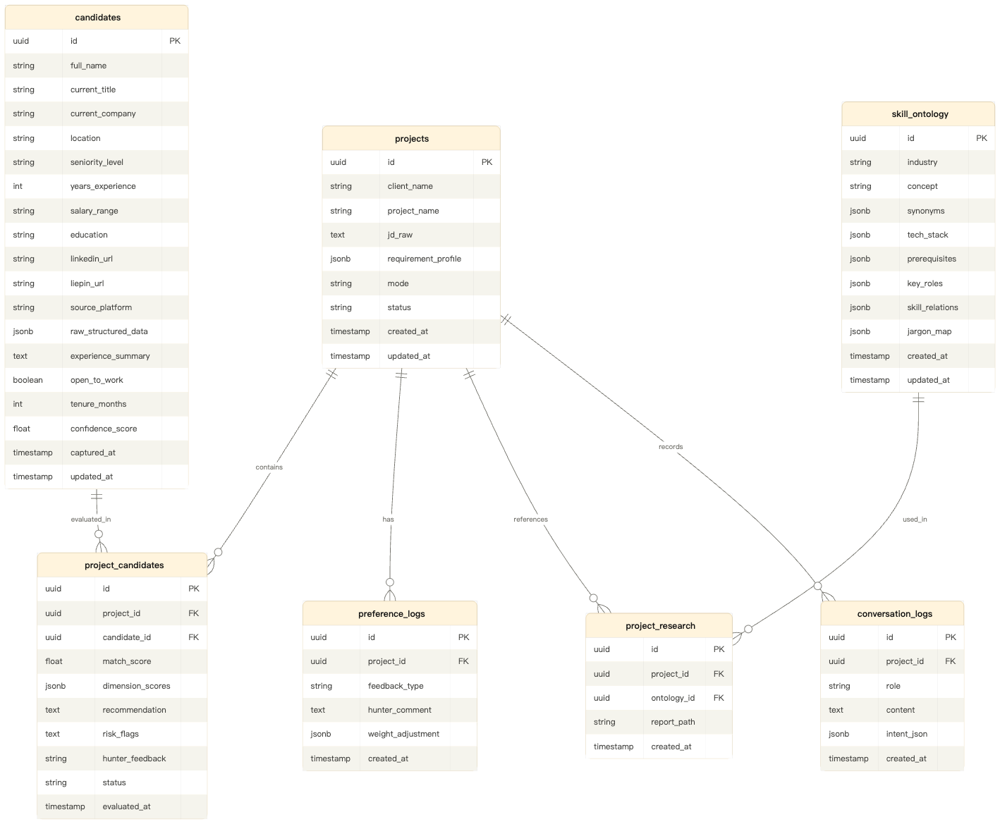

CA的对话层和编排层的接口契约：

暂定create_project、clarify_requirement、search_talent_pool、
trigger_evaluation、request_industry_research、
update_preference、change_project_context

表的ER图

## 七张 SQL 表的设计逻辑

**`projects`** — 每个猎头任务就是一个项目。`jd_raw` 存客户原始的职位描述文本，`requirement_profile` 是CA通过需求澄清后生成的结构化JSON画像（包含硬性条件、软性条件、优先级等）。`mode` 记录当前是"精准模式"还是"探索模式"。这张表是整个系统的锚点，几乎所有其他表都关联到它。

**`candidates`** — 全局人才池，不绑定任何项目。Chrome插件采集的数据拆成两部分存：标量字段（location、years_experience、salary_range等）直接存列，用于SQL硬性过滤；`experience_summary` 是清洗后的工作经历文本，同时embedding后存入向量数据库（向量库中存candidate_id作为外键关联回来）。`raw_structured_data` 用JSONB存插件提取的完整原始结构化数据，作为备份和后续需要时的数据源。`confidence_score` 就是你设计的信息置信度评分。

**`project_candidates`** — 这是项目和候选人之间的关联表，也是EA的评估结果存储地。`match_score` 是总匹配百分比，`dimension_scores` 是各维度的详细打分JSON（比如`{"技能匹配": 85, "管理经验": 60, "地点": 100}`），`recommendation` 是推荐理由文本，`risk_flags` 是风险提示。`hunter_feedback` 记录猎头的反馈（"不错"/"不行"/"技术够但管理经验不足"），`status` 标记候选人在这个项目中的状态（待评估/已推荐/已淘汰/已面试等）。

**`preference_logs`** — 记录猎头在某个项目中的每一次偏好反馈。当猎头说"这个人技术够但管理经验太少"，CA会解析这句话，生成一条记录：`feedback_type: "weight_adjustment"`，`hunter_comment: 原文`，`weight_adjustment: {"管理经验": +15}`。EA每次评估前读取该项目的所有preference_logs作为上下文。

**`skill_ontology`** — RA产出的结构化技能图谱。每条记录代表一个行业概念（比如"大模型部署"）。字段和你PRD中设计的JSON结构一一对应。这张表跨项目共享——如果两个项目都涉及AI行业，它们引用同一条ontology记录。

**`project_research`** — 项目和skill_ontology的关联表。同时存了RA生成的Markdown报告的文件路径。一个项目可以关联多个行业概念。

**`conversation_logs`** — CA对话层的完整记录。`role` 是"hunter"或"assistant"，`intent_json` 记录CA从每轮对话中解析出的结构化意图（比如`{action: "search_talent_pool", filters: {...}}`）。这张表既用于审计追溯，也用于CA在长对话中保持上下文。

## 向量数据库（ChromaDB，本地文件存储）

存储路径：`~/Desktop/Eagle/data/chroma/`

共 3 个 ChromaDB collection：

**candidate_embeddings** — 每个候选人的工作经历 embedding，关联 candidate_id。EA 做软匹配时查询这个 collection。

**industry_knowledge** — RA 产出的行业报告分段 embedding，关联 source_ontology_id。EA 做"软性理解"（比如发现"光伏逆变器"和"储能"语义相近）时查询这个。

**requirement_embeddings** — 项目需求画像的 embedding，关联 project_id。用于将来做"这个新入库的候选人可能适合你的 B 项目"的反向推荐。

所有三个 collection 的 metadata 中都记录了 `embedding_model_version`，方便将来迁移。